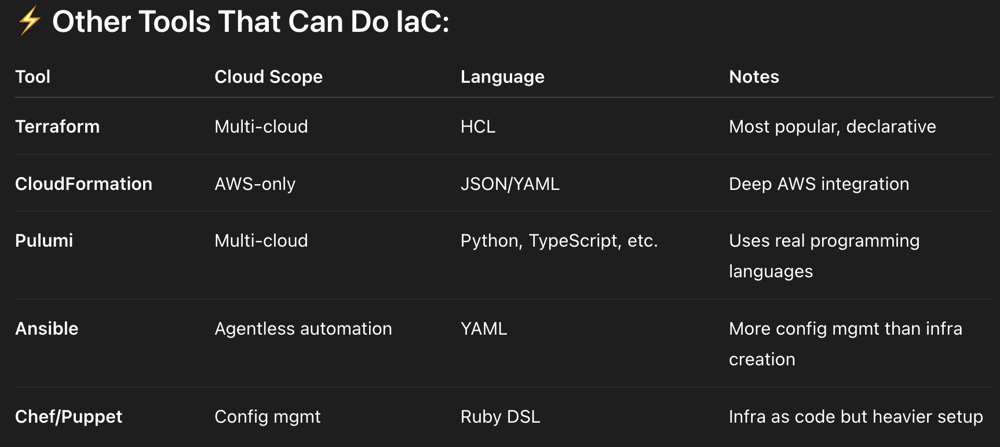

# 🚀 Deploying AWS Infrastructure using Terraform

This project demonstrates how to **provision and manage AWS resources** using **Terraform**, an open-source Infrastructure as Code (IaC) tool. Instead of manually configuring your cloud infrastructure via the AWS Console, this project helps you automate the entire process — reliably, consistently, and with version control.

---

## 🎯 Purpose of the Practical

Understanding Infrastructure as Code (IaC):
- Instead of manually setting up resources on AWS, we wrote code to do it.

- This code is repeatable, version-controlled, auditable, and automatable.

- Helps avoid human error, especially in large-scale environments.
## 🌍 What is Terraform?

[Terraform](https://developer.hashicorp.com/terraform) by HashiCorp is a powerful IaC tool that uses a **declarative language (HCL)** to define and provision cloud infrastructure.

Terraform reads your `.tf` code and communicates with cloud provider APIs (like AWS) to create resources — such as EC2 instances — while you focus on *what* to build, not *how* to build it.


---

## What You Achieved in This Practical

- Used variables (variables.tf, terraform.tfvars) to make code dynamic and reusable.

- Used outputs (outputs.tf) to expose useful post-creation data (like IP).

- Applied the init → plan → apply Terraform lifecycle.

- Built a foundation that you can extend into complex infrastructure.
---

## 🤓 Frequently Asked Viva/Interview Questions

### ❓ Why use Terraform over AWS CloudFormation?

**Answer**:  
Terraform is **multi-cloud** and uses a simpler syntax. While CloudFormation is AWS-native, Terraform supports Azure, GCP, and other platforms with the same tool and codebase. It also has better dependency management and a vibrant open-source ecosystem.

---

### ❓ Why use variables and outputs?

**Answer**:  
Variables allow flexibility and reusability, so you don’t hardcode values. Outputs make it easy to access key information (like EC2 Public IP) after deployment.

---

### ❓ Can you achieve the same result without Terraform?

**Answer**:  
Yes, using the AWS Console or CLI. But these methods are **manual**, **non-repeatable**, and **error-prone**. Terraform ensures you can **automate and replicate** infrastructure in a clean and consistent manner.

---

### ❓ How does Terraform fit in a DevOps pipeline?

**Answer**:
- 🔄 Infra provisioning becomes part of **CI/CD**
- 🧪 You can test infrastructure code before deployment
- 🎯 Infrastructure is **versioned, reviewed**, and **collaborative**
- ⏪ Rollbacks and environment consistency become easy


[](./comparison.png)
---

# Getting Started With This

## 1. Install terraform via [terraform.io](https://developer.hashicorp.com/terraform/install)
- Move Terraform to the C drive
- Copy the path of the “terraform.exe” file
- Open Environment Variables > System Variables > Path
- Add the path of the “terraform.exe” file to the environment variables.
- check by running the command in cmd
```bash
terraform --version
```

## 2. Install AWS CLI via [aws.amazon.com](https://docs.aws.amazon.com/cli/latest/userguide/getting-started-install.html)
- check by running the command in cmd
```bash
aws --version
```

## 3. Create a IAM user:
- Make sure to add permission for administartive access in “attach policies directly” 
- create access key and secret key

## 4. Configure AWS CLI:
```bash
aws configure
```

## 5. Create a folder with this structure:
- main.tf
- variables.tf
- outputs.tf
- terraform.tfvars

## 6. run terraform commands:
```bash
terraform init
terraform plan
terraform apply
```
